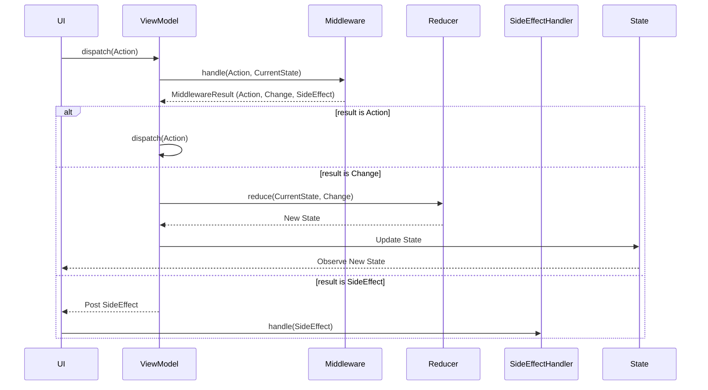

# Orbit MVI ViewModel Redux

`ReduxViewModel` is a library built on top of the [Orbit MVI](https://github.com/orbit-mvi/orbit-mvi) framework. It integrates the Redux pattern to make state management more structured and predictable in Android ViewModels.

## Architecture Flow

The following diagram illustrates how actions flow through the system:



## Key Concepts

- **State**: An immutable data class representing the UI state.
- **Action**: A sealed interface defining user intentions or system events.
- **Change**: Internal events produced by Middleware to trigger state updates in the Reducer.
- **SideEffect**: One-time events like Toast notifications, Navigation, or Dialogs.
- **Middleware**: Handles business logic and asynchronous tasks. It processes `Action` and emits `Change`, other `Action`s, or `SideEffect`s.
- **Reducer**: A pure function that takes the current `State` and a `Change` to produce a new `State`.
- **SideEffectHandler**: An interface for handling emitted `SideEffect`s in the UI layer (Activity, Fragment, etc.).

## Getting Started

### 1. Define Components

Define the State, Action, Change, and SideEffect for your ViewModel.

```kotlin
data class MainState(val count: Int = 0, val isLoading: Boolean = false)

sealed interface MainAction {
    object ClickPlus : MainAction
    object ClickMinus : MainAction
    object LoadData : MainAction
}

sealed interface MainChange {
    object Increment : MainChange
    object Decrement : MainChange
    data class SetLoading(val isLoading: Boolean) : MainChange
}

sealed interface MainSideEffect {
    data class ShowToast(val message: String) : MainSideEffect
}
```

### 2. Implement Middleware

Implement `Middleware` to handle business logic. You can easily emit events using `change()`, `dispatch()`, and `sideEffect()` helper functions provided within the `Middleware` scope.

#### Implementing Interface (Standard)
```kotlin
class MainMiddleware : Middleware<MainState, MainAction, MainChange, MainSideEffect> {
    override fun handle(
        action: MainAction,
        state: MainState
    ): Flow<MiddlewareResult<MainAction, MainChange, MainSideEffect>> = when (action) {
        MainAction.ClickPlus -> change(MainChange.Increment)
        MainAction.ClickMinus -> change(MainChange.Decrement)
        MainAction.LoadData -> flow {
            change(MainChange.SetLoading(true))
            // Perform async work...
            change(MainChange.SetLoading(false))
            sideEffect(MainSideEffect.ShowToast("Data Loaded"))
        }
    }
}
```

#### Using DSL
For simple cases, you can use the `middleware` factory function.
```kotlin
val mainMiddleware = middleware<MainState, MainAction, MainChange, MainSideEffect> { action, state ->
    when (action) {
        MainAction.ClickPlus -> change(MainChange.Increment)
        else -> emptyFlow()
    }
}
```

### 3. Implement Reducer

Implement `Reducer` to define how `Change` updates the `State`.

```kotlin
class MainReducer : Reducer<MainState, MainChange> {
    override fun reduce(state: MainState, change: MainChange): MainState {
        return when (change) {
            MainChange.Increment -> state.copy(count = state.count + 1)
            MainChange.Decrement -> state.copy(count = state.count - 1)
            is MainChange.SetLoading -> state.copy(isLoading = change.isLoading)
        }
    }
}
```

### 4. Implement SideEffectHandler (Optional)

You can use `SideEffectHandler` to encapsulate side effect handling logic.

```kotlin
class MainSideEffectHandler(
    private val context: Context
) : SideEffectHandler<MainSideEffect> {
    override suspend fun handle(sideEffect: MainSideEffect) {
        when (sideEffect) {
            is MainSideEffect.ShowToast -> {
                Toast.makeText(context, sideEffect.message, Toast.LENGTH_SHORT).show()
            }
        }
    }
}
```

### 5. Create ViewModel

Inherit from `ReduxViewModel` and pass the initial state, middlewares, and reducer.

```kotlin
class MainViewModel(
    middlewares: List<Middleware<MainState, MainAction, MainChange, MainSideEffect>>,
    reducer: Reducer<MainState, MainChange>
) : ReduxViewModel<MainState, MainAction, MainChange, MainSideEffect>(
    initialState = MainState(),
    middlewares = middlewares,
    reducer = reducer
)
```

### 6. Use in UI

```kotlin
// In your Activity or Fragment
val sideEffectHandler = MainSideEffectHandler(this)

// Dispatch an action
viewModel.dispatch(MainAction.ClickPlus)

// Observe State
lifecycleScope.launch {
    viewModel.container.stateFlow.collect { state ->
        // Update UI
    }
}

// Observe SideEffects using SideEffectHandler
lifecycleScope.launch {
    viewModel.container.sideEffectFlow.collect { sideEffect ->
        sideEffectHandler.handle(sideEffect)
    }
}
```

## License

This project is licensed under the Apache License, Version 2.0.
